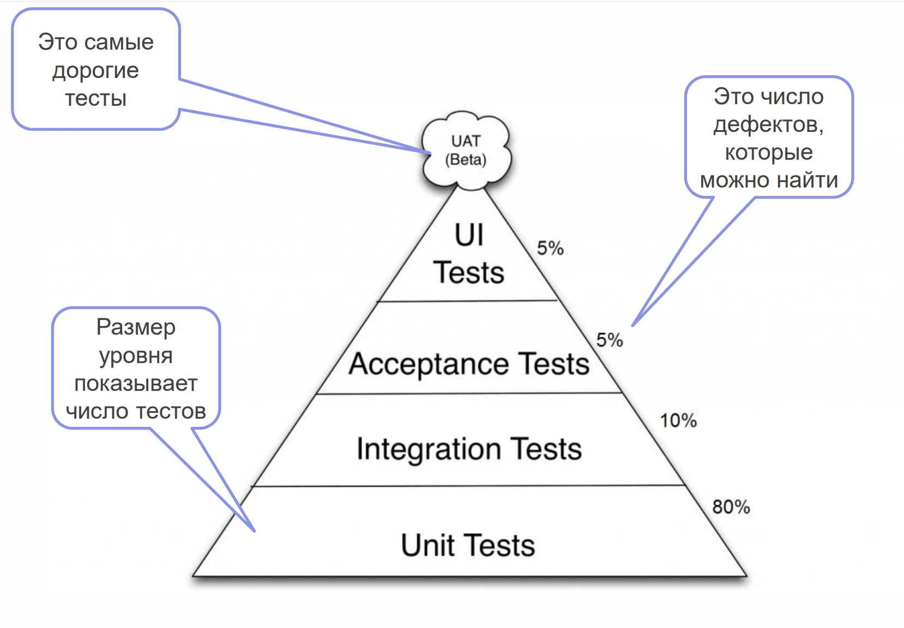
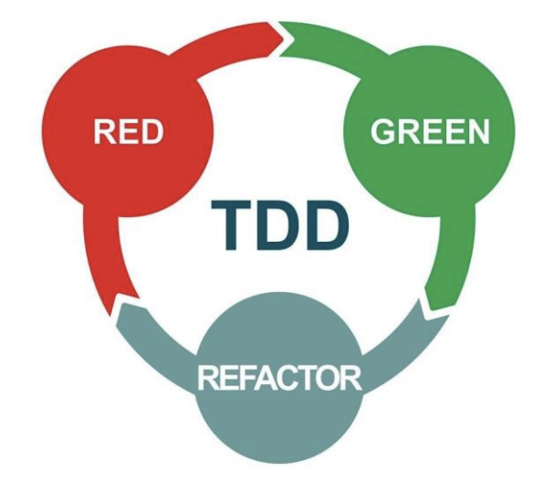
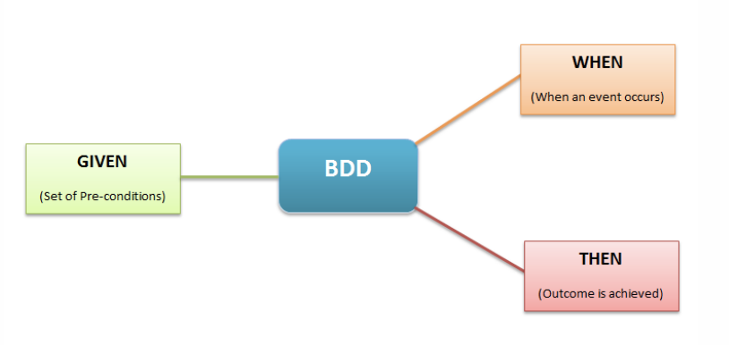

(c) Otus.ru

**Quality Assurance** 
-
(“QA”, “Обеспечение качества”, “Управление качеством”) – это процесс или результат формирования требуемых свойств и характеристик продукции по мере её создания, а также – поддержание этих характеристик при хранении, транспортировании и эксплуатации продукции

В применении к ПО это означает нечто, позволяющее нам убедиться в том, что данное ПО ведет себя ожидаемым образом в разного рода ситуациях.

Пирамида тестирования
-


Виды тестов 
- 
- Модульное (Unit) тестирование – проверка работы программы на уровне отдельных модулей (классов, методов) 
- Интеграционное тестирование – проверка совместной работы нескольких модулей 
- Приемочное (Acceptance) тестирование – проверка работы функций программы с точки зрения пользователя, а не только с технической точки зрения. Так же называют функциональным (Functional)
- UI тестирование – проверка корректности поведения интерфейса (все на своих местах, переходы осуществляются ожидаемым образом)


- Системные тесты – тестирование системы в целом.
- Нагрузочные тесты – тестирование системы на работу под заданной/ожидаемой нагрузкой.
- Стресс-тесты – тестирование системы на работу под нагрузкой превышающей ожидаемую.
- Тестирование установки – тестирование установки (и удаления) системы. Все необходимые файлы в наличии, компоненты зарегистрированы, службы запущены и т.д.


- Black Box тесты – тестирование поведения системы, основанное на работе исключительно с внешними интерфейсами. Знаем, что должна делать система, но не знаем, как это реализовано внутри.
- White Box тесты – метод тестирования программного обеспечения, который предполагает, что внутренняя структура/устройство/реализация системы известны
тестировщику.
- Grey Box тесты – детали реализации системы известны лишь частично.


Инструменты тестирования (Unit)
-

- Runner-ы тестов 
    - surefire-maven-plugin – специальный плагин для запуска тестов 
    - Runner тестов в IDE (IntelliJ IDEA)
- Тестовые фреймворки (синтаксис тестов, базовые matcher-ы)
    - JUnit 4, 5
    - TestNG
- Внешние библиотеки для создания моков/заглушек
    - Mockito
    - PowerMock
- Внешние библиотеки matcher-ов
    - AssertJ
    - Hamcrest

Mock & Spy
-
- Mock – заглушка, которой можно подменить полноценную зависимость класса при тестировании. Либо не содержит никакой логики вообще, либо только ту, что необходима для тестов.
- Spy – тоже заглушка, но содержащая “под капотом” полноценную реализацию зависимости, у которой для тестирования изменено поведение каких-либо методов или просто позволяющая следить за фактом (и/или порядком) вызовов методов.

И то и другое чаще всего создается и настраивается средствами внешней библиотеки (например, Mockito). Но можно и написать самим

```java
public class AnyServiceTest { 
    @Test
    public void anyMethodTest() {
        AnyDependency1 dependency1 = Mockito.spy(new AnyDependency1());
        Mockito.when(dependency1.anyMethod()).thenReturn("ok");

        AnyDependency2 dependency2 = Mockito.mock(AnyDependency2.class);
        Mockito.when(dependency2.anyMethod()).thenReturn("no");

        AnyService anyService = new AnyService(dependency1, dependency2);

        Assertions.assertEquals("ok", anyService.useDependency1());
        Assertions.assertNotEquals("no", anyService.useDependency1());

        Assertions.assertTrue(anyService.useDependency2().startsWith("n"));
        Assertions.assertFalse(anyService.useDependency2().endsWith("k"));

        Mockito.verify(dependency1, Mockito.times(2)).anyMethod();
        Mockito.verify(dependency2, Mockito.times(2)).anyMethod(); 
    }
}
```

Популярные методологии – TDD
-
- TDD – это методология, при которой разработка ведется короткими итерациями тест-реализация
- Т.е. изначально пишется тест, потом код, который приведет к тому, чтобы тест прошел. И так пока не будет достигнуто желаемое поведение
- Считается, что такой подход позволяет выявлять больше ошибок, а так же способствует максимальному покрытию тестами


Популярные методологии – BDD
-
- BDD – расширение подхода TDD к разработке и тестированию, при котором особое внимание уделяется поведению системы/модуля в терминах бизнеса (заказчика)
- Как правило, такие тесты иллюстрируют и тестируют различные сценарии, которые интересны непосредственно клиенту системы
- В связи с этим при составлении таких тестов часто используется фреймворки, обладающие синтаксисом, обеспечивающим читаемость тестов не только программистом, но и представителями заказчика


Итоги:
-
##### Unit-тесты
- Unit-тесты должны приводить к одному и тому же результату не зависимо от того сколько раз они будут запущены и когда 
- Не должны зависеть друг от друга
- Не должны иметь заданного порядка запуска и/или зависеть от него
- В идеале должны быть готовы к запуску в многопоточном режиме
- Частично это достигается за счет выполнения тестов на новом экземпляре тестового класса по умолчанию

##### Зачем нужно юнит-тестирование
- Выявляет большинство ошибок
- Позволяет не повторять ошибки, исправление которых зафиксировано в тестах
- Т.к. это самые дешевые тесты, то можно быстро прогнать их большое количество, тем самым проверить, что ничего не сломалось
- Что позволяет не бояться вносить изменения в код, выполнять рефакторинг
- Вынуждает писать код, более правильный с архитектурной точки зрения*